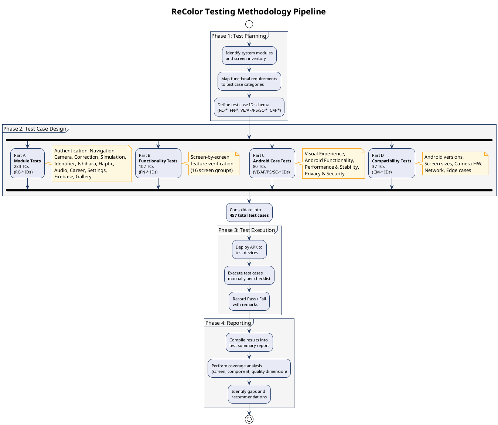
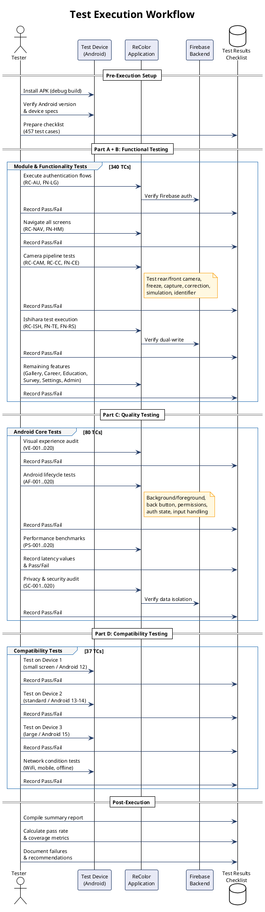
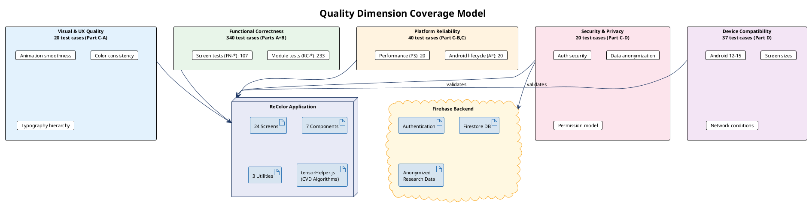
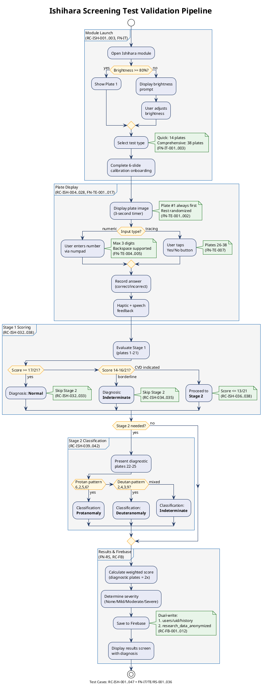

# ReColor — Chapter 3 Testing Methodology PlantUML Diagrams

> Six PlantUML diagrams for the Testing Methodology section of Chapter 3.
> Copy each `@startuml ... @enduml` block into a `.puml` file or PlantUML renderer.

---

## Diagram 1: Testing Framework Overview (Activity Diagram)

Shows the overall testing methodology pipeline from test planning through execution to reporting.



**Suggested Caption:** Figure 3.X: Testing Methodology Pipeline

---

## Diagram 2: Test Case Classification Hierarchy (Mind Map)

Shows how the 457 test cases are organized across the four document parts.

```plantuml
@startuml test_case_hierarchy
!theme plain
skinparam backgroundColor #FFFFFF
skinparam DefaultFontSize 11

<style>
mindmapDiagram {
  node {
    BackgroundColor #E8EAF6
    BorderColor #1F3864
    FontColor #1F3864
    RoundCorner 10
  }
  :depth(0) {
    BackgroundColor #1F3864
    FontColor #FFFFFF
    FontSize 14
    FontStyle bold
  }
  :depth(1) {
    BackgroundColor #2E74B5
    FontColor #FFFFFF
    FontSize 12
    FontStyle bold
  }
  :depth(2) {
    BackgroundColor #D6E4F0
    FontColor #1F3864
    FontSize 10
  }
}
</style>

title **ReColor Test Case Classification**

* 457 Test Cases
** Part A: Module Tests (233)
*** RC-AU: Authentication (20)
*** RC-NAV: Navigation (12)
*** RC-CAM: Camera (39)
*** RC-CC: Color Correction (27)
*** RC-SIM: CVD Simulation (7)
*** RC-CI: Color Identifier (20)
*** RC-ISH: Ishihara Screening (47)
*** RC-HF: Haptic Feedback (9)
*** RC-AF: Audio Feedback (11)
*** RC-CA: Career Awareness (8)
*** RC-SET: Settings (9)
*** RC-FB: Firebase (12)
*** RC-GAL: Gallery (12)
** Part B: Functionality Tests (107)
*** FN-SP: Splash Screen (3)
*** FN-OB: App Onboarding (6)
*** FN-LG: Login & Auth (6)
*** FN-HM: Home Screen (5)
*** FN-IT: Ishihara Intro (6)
*** FN-TE: Test Execution (17)
*** FN-RS: Results & Scoring (13)
*** FN-CE: Camera Enhancement (14)
*** FN-CI: Color Identifier (6)
*** FN-SIM: CVD Simulation (5)
*** FN-GL: CVD Gallery (4)
*** FN-ED: Education & Articles (6)
*** FN-SV: Survey (3)
*** FN-ST: Settings (8)
*** FN-HI: History (3)
*** FN-AD: Admin & Research (6)
** Part C: Android Core (80)
*** VE: Visual Experience (20)
*** AF: Android Functionality (20)
*** PS: Performance & Stability (20)
*** SC: Privacy & Security (20)
** Part D: Compatibility (37)
*** CM-AV: Android Versions (7)
*** CM-SS: Screen Sizes (8)
*** CM-OR: Orientation (2)
*** CM-CH: Camera Hardware (7)
*** CM-NW: Network Conditions (8)
*** CM-DV: Device Edge Cases (7)
left side
@enduml
```

**Suggested Caption:** Figure 3.X: Test Case Classification Hierarchy

---

## Diagram 3: Screen Coverage Traceability Matrix (Component Diagram)

Maps each application screen to the test case categories that cover it.

```plantuml
@startuml screen_coverage_traceability
!theme plain
skinparam backgroundColor #FFFFFF
skinparam ComponentBackgroundColor #E8EAF6
skinparam ComponentBorderColor #1F3864
skinparam PackageBackgroundColor #F5F5F5
skinparam PackageBorderColor #2E74B5
skinparam ArrowColor #2E74B5
skinparam NoteFontSize 9
skinparam DefaultFontSize 10

title **Screen-to-Test-Case Traceability**

package "Authentication Flow" as auth {
  [SplashScreen] as SP
  [AppOnboarding] as OB
  [LoginScreen] as LG
  [SignUp] as SU
}

package "Main Application" as main_pkg {
  [HomeScreen] as HM
  [ProfileScreen] as PR
  [HistoryScreen] as HI
  [SettingsScreen] as ST
}

package "Ishihara Test Flow" as ish {
  [IshiharaIntroScreen] as II
  [IshiharaOnboarding] as IO
  [TestScreen] as TS
  [ResultsScreen] as RS
  [SurveyScreen] as SV
}

package "Camera Pipeline" as cam {
  [CameraEnhanceScreen] as CE
  [ColorIdentifierScreen] as CI
  [CVDSimulationScreen] as CS
  [CVDGalleryScreen] as GL
}

package "Content Screens" as content {
  [EducationListScreen] as ED
  [ArticleScreen] as AR
  [CareerDetail] as CD
}

package "Admin Portal" as admin {
  [AdminLoginScreen] as AL
  [AdminHubScreen] as AH
  [ResearchDashboard] as RD
}

note right of SP : FN-SP, VE-001, PS-001/002
note right of OB : FN-OB, VE-002
note right of LG : RC-AU, FN-LG, SC-001..003
note right of SU : RC-AU-001..007

note right of HM : RC-NAV, FN-HM
note right of PR #FFF3CD : **Partial** - needs dedicated TCs
note right of HI : FN-HI-001..003
note right of ST : RC-SET, FN-ST, VE-016

note right of II : FN-IT-001..003
note right of IO : FN-IT-004..006
note right of TS : RC-ISH (47), FN-TE (17), VE, PS
note right of RS : FN-RS (13), VE-013

note right of CE : RC-CAM (39), RC-CC (27), FN-CE (14)
note right of CI : RC-CI (20), FN-CI (6), VE-014/015
note right of CS : RC-SIM (7), FN-SIM (5), PS-006/007
note right of GL : RC-GAL (12), FN-GL (4)

note right of CD #FFF3CD : **Partial** - needs detail tests
note right of ED : FN-ED-001..002
note right of AR : FN-ED-003..006, VE-017

note right of AL : FN-AD-001..002
note right of AH : FN-AD-003..004
note right of RD : FN-AD-005/006, VE-019, SC-017

@enduml
```



**Suggested Caption:** Figure 3.X: Screen-to-Test-Case Traceability Matrix

---

## Diagram 4: Testing Execution Workflow (Sequence Diagram)

Shows the step-by-step process a tester follows when executing the test suite.



**Suggested Caption:** Figure 3.X: Test Execution Workflow

---

## Diagram 5: Quality Dimension Coverage (Deployment Diagram)

Shows the quality dimensions tested and their relationship to the system.



**Suggested Caption:** Figure 3.X: Quality Dimension Coverage Model

---

## Diagram 6: Ishihara Test Scoring Pipeline (Activity Diagram)

Shows the detailed testing flow for the Ishihara screening module — the most extensively tested feature (64 TCs).



**Suggested Caption:** Figure 3.X: Ishihara Screening Test Validation Pipeline

---

## Usage Instructions

1. Copy each `@startuml ... @enduml` block
2. Paste into [PlantUML Online Server](https://www.plantuml.com/plantuml/uml) or a local PlantUML renderer
3. Export as PNG (300 DPI recommended for print)
4. Insert into Chapter 3 manuscript with appropriate figure captions

### Suggested Figure Captions

| Diagram | Suggested Caption |
|---------|-------------------|
| 1 | Figure 3.X: Testing Methodology Pipeline |
| 2 | Figure 3.X: Test Case Classification Hierarchy |
| 3 | Figure 3.X: Screen-to-Test-Case Traceability Matrix |
| 4 | Figure 3.X: Test Execution Workflow |
| 5 | Figure 3.X: Quality Dimension Coverage Model |
| 6 | Figure 3.X: Ishihara Screening Test Validation Pipeline |
